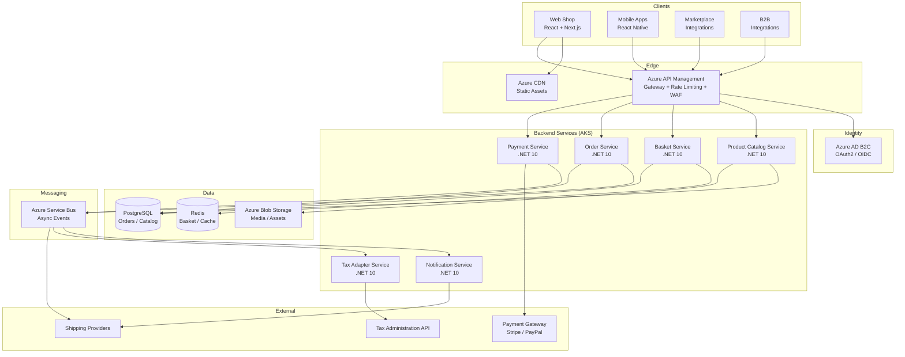
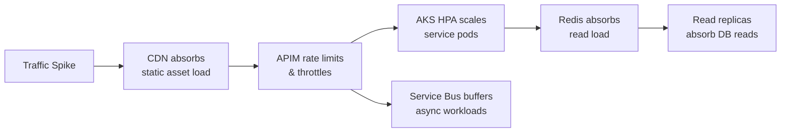
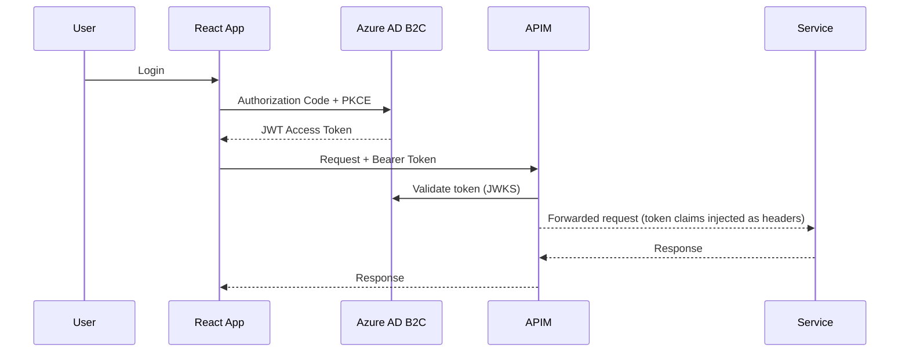
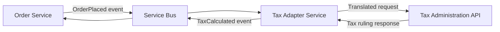
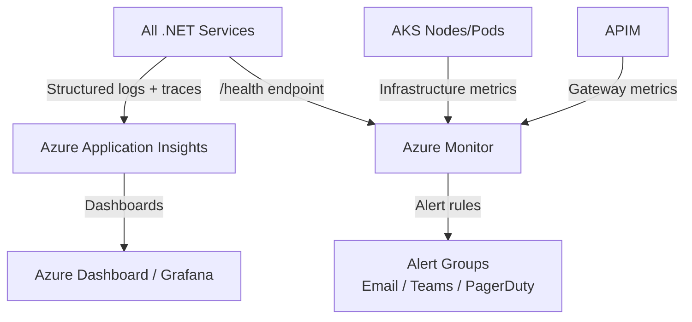
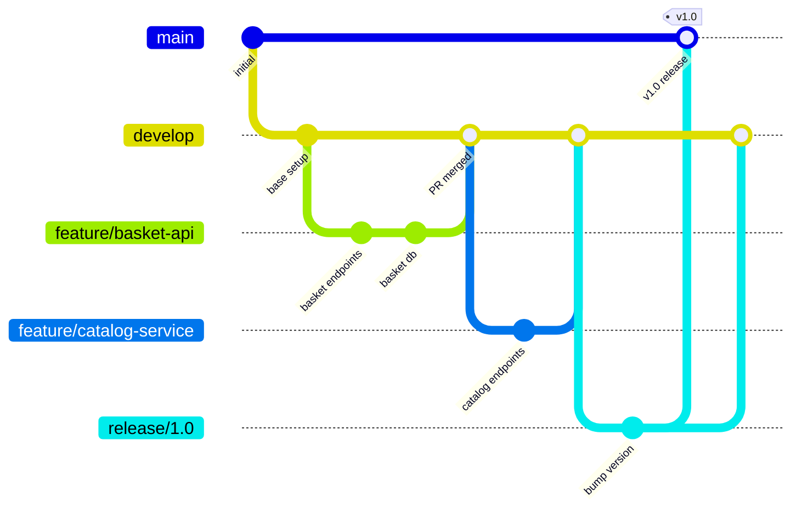
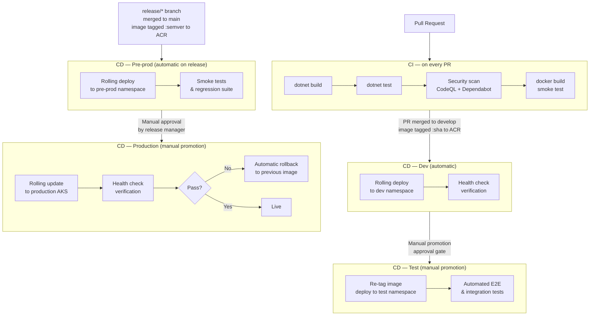

# High-Level System Design: Global Online Retail Platform

> **Audience:** Cross-functional engineering teams + client stakeholders  
> **Scope:** Architecture vision, technology selection, and implementation strategy for a global retail platform serving millions of daily users across web, mobile, marketplace, and B2B channels.

---

## Table of Contents

1. [Architectural View](#1-architectural-view)
2. [Key Components & Responsibilities](#2-key-components--responsibilities)
3. [Scaling Strategy](#3-scaling-strategy)
4. [Security & Authentication](#4-security--authentication)
5. [External Service Integrations](#5-external-service-integrations)
6. [Monitoring & Alerting](#6-monitoring--alerting)
7. [Code Delivery Plan](#7-code-delivery-plan)

---

## 1. Architectural View

The system follows a **microservices architecture** deployed on **Azure Kubernetes Service (AKS)**. All client channels funnel through a single API Gateway which routes requests to the appropriate backend service. Services communicate synchronously over REST for real-time operations and asynchronously via **Azure Service Bus** for event-driven workflows.

### 1.1 High-Level Diagram

### 1.2 Communication Patterns

| Pattern | When Used | Technology |
|---|---|---|
| Synchronous REST | Client-facing requests (basket, catalog, checkout) | HTTPS / JSON |
| Async messaging | Order placed, payment confirmed, tax calculation, notifications | Azure Service Bus |
| Cache-aside | Product lookups, basket reads | Redis |
| Webhook (inbound) | Payment confirmation from Stripe/PayPal | HTTPS POST → Service Bus |

### 1.3 Technology Selection

| Concern | Technology | Rationale |
|---|---|---|
| Backend services | .NET 10 ASP.NET Core | Latest LTS, high performance, first-class Azure integration |
| Web frontend | React + Next.js | SSR for SEO, large ecosystem, client requirement |
| Mobile | React Native | Code sharing with web, single team skillset |
| API Gateway | Azure API Management | Managed, built-in WAF, rate limiting, analytics |
| Identity | Azure AD B2C | Managed OAuth2/OIDC, scales to millions of users |
| Relational DB | PostgreSQL (Azure Database) | Open source, ACID, strong EF Core support |
| Cache / Session | Redis (Azure Cache) | Sub-millisecond reads, ideal for basket and hot data |
| Blob storage | Azure Blob Storage | Product images, documents |
| Async messaging | Azure Service Bus | Durable, ordered delivery, dead-letter queues |
| Container runtime | Docker + AKS | Industry standard, autoscaling, self-healing |
| Container registry | Azure Container Registry | Native AKS integration |
| Secrets | Azure Key Vault | Centralised, audited secret management |
| Monitoring | Azure Application Insights | Distributed tracing, logs, metrics |
| CI/CD | GitHub Actions | Free for public repos, tightly integrated with the ecosystem |

---

## 2. Key Components & Responsibilities

### 2.1 API Gateway (Azure API Management)
- Single entry point for all client channels
- TLS termination, WAF, DDoS protection
- Rate limiting and throttling per subscription/client
- JWT validation before forwarding to services
- Request routing, versioning, and transformation

### 2.2 Identity Service (Azure AD B2C)
- User registration, login, password reset, social login
- Issues JWT access tokens (OAuth2 Authorization Code + PKCE for web/mobile)
- Service-to-service auth via Client Credentials flow
- Token validation is offloaded to APIM — services trust validated tokens only

### 2.3 Product Catalog Service
- Manages product listings, categories, pricing, and media references
- Read-heavy; uses Redis cache-aside for hot products
- Publishes `ProductUpdated` events to Service Bus for downstream consumers
- PostgreSQL for persistent storage; Azure Blob for images

### 2.4 Basket Service *(implemented in this repo)*
- Manages per-user shopping cart lifecycle
- Stores basket state in Redis (fast read/write) with PostgreSQL as persistent fallback
- Validates product availability and price on item add
- Emits `BasketCheckedOut` event to Service Bus to trigger Order creation
- Stateless service — basket state is tied to `userId`, not a server session

### 2.5 Order Service
- Consumes `BasketCheckedOut` events
- Orchestrates the order lifecycle: `Pending → Confirmed → Shipped → Delivered`
- Publishes `OrderPlaced` and `OrderShipped` events
- Owns the Orders table in PostgreSQL

### 2.6 Payment Service
- Integrates with Stripe/PayPal via outbound REST calls
- Receives inbound payment webhooks; publishes `PaymentConfirmed` / `PaymentFailed` to Service Bus
- No sensitive card data stored — PCI-DSS scope minimised via tokenization at gateway

### 2.7 Tax Adapter Service
- Anti-corruption layer between the platform and external Tax Administration APIs
- Translates internal order/product models to the tax authority's schema
- Called asynchronously via Service Bus before order confirmation

### 2.8 Notification Service
- Consumes events (OrderPlaced, PaymentConfirmed, OrderShipped, etc.)
- Sends email, push notification, and SMS via pluggable provider adapters (SendGrid, Firebase, Twilio)
- Fan-out pattern: one event → multiple notification channels

---

## 3. Scaling Strategy

The system is designed to scale **horizontally** at every layer. No single component is a bottleneck at rest.

### 3.1 Compute — AKS Horizontal Pod Autoscaler (HPA)
- Each service is an independent Kubernetes Deployment
- HPA scales pod count based on CPU utilisation and custom metrics (e.g., Service Bus queue depth)
- Node autoscaler provisions additional VMs when pod demand exceeds node capacity
- Services are stateless by design → pods can be added/removed freely

### 3.2 Caching — Redis
- **Basket reads** served from Redis (sub-millisecond) — eliminates DB round-trips for the most frequent user action
- **Product catalog** hot items cached with TTL — absorbs traffic spikes during flash sales
- **Refresh token revocation** — issued refresh tokens are tracked in Redis to support explicit logout and suspicious-activity invalidation (JWT access tokens are stateless and need no storage; only revocable refresh tokens do)
- **Rate limiting counters** — per-user request counts stored in Redis for sliding-window throttling at the service level
- **Idempotency keys** — short-lived keys deduplicate retried checkout requests

### 3.3 Database Scaling
- **Read replicas** on PostgreSQL for catalog and order queries (CQRS read-side)
- **Connection pooling** via PgBouncer sidecar per service
- **Partitioning** on Orders table by date range for archival and query performance
- **Azure Database for PostgreSQL Flexible Server** — managed scaling, automated backups

### 3.4 Asynchronous Offloading — Azure Service Bus
- Long-running operations (tax calculation, shipping label generation, notifications) are decoupled from the synchronous request path
- Checkout endpoint returns `202 Accepted` immediately; Order creation happens asynchronously
- Dead-letter queues catch failures for retry without data loss

### 3.5 Edge — CDN & API Gateway
- React frontend assets served from **Azure CDN** (static files, images) — removes load from origin entirely
- APIM enforces rate limits per client tier, preventing any single consumer from degrading the platform

---

## 4. Security & Authentication

### 4.1 Authentication Flow

### 4.2 Security Controls

| Layer | Control |
|---|---|
| Edge | TLS 1.3 everywhere; Azure DDoS Standard on APIM |
| Gateway | JWT validation; rate limiting per subscription; IP allowlisting for B2B |
| Transport | All inter-service communication over mTLS within AKS (Istio service mesh, optional) |
| Application | Input validation on all endpoints; EF Core parameterised queries (no raw SQL) |
| Data at rest | Azure Disk Encryption; PostgreSQL Transparent Data Encryption |
| Secrets | All credentials in Azure Key Vault; services use Managed Identities (no stored credentials) |
| Dependencies | Dependabot / GitHub Advanced Security for CVE scanning on NuGet and npm packages |

### 4.3 OWASP Top 10 Mitigations

| Risk | Mitigation |
|---|---|
| Injection | EF Core parameterised queries; no raw SQL |
| Broken Authentication | Azure AD B2C; short-lived JWTs; refresh token rotation |
| Sensitive Data Exposure | HTTPS everywhere; Key Vault; no PII in logs |
| Broken Access Control | Claims-based authorisation in each service; user can only access own basket |
| Security Misconfiguration | Infrastructure as Code (Bicep/Terraform); no default credentials |
| Vulnerable Components | Dependabot automated PRs; CI security scan step |

---

## 5. External Service Integrations

All external integrations follow the **Anti-Corruption Layer (ACL)** pattern: a thin adapter service translates between the internal domain model and the external system's schema. This isolates the platform from external API changes.

| External System | Integration Pattern | Notes |
|---|---|---|
| Tax Administration | Async REST via Service Bus adapter | Adapter handles schema translation, retries, and circuit breaker |
| Stripe / PayPal | Outbound REST + inbound webhook | Webhook receiver validates signature before publishing to Service Bus |
| Shipping Providers | Event-driven (OrderShipped event → adapter → provider API) | Multiple providers supported via pluggable adapter |
| Email / Push / SMS | Notification Service adapters (SendGrid, Firebase, Twilio) | Provider-agnostic interface; swappable without core changes |

### Resilience Patterns

- **Circuit Breaker** (Polly): prevents cascading failures when external APIs are degraded
- **Retry with exponential backoff** (Polly): transient fault handling
- **Dead-letter queue**: messages that exhaust retries are held for manual inspection
- **Timeout**: all outbound HTTP calls have explicit timeouts

---

## 6. Monitoring & Alerting

### 6.1 Observability Stack

### 6.2 Health Checks

Every service exposes two endpoints:

| Endpoint | Purpose |
|---|---|
| `GET /health/live` | Kubernetes liveness probe — is the process alive? |
| `GET /health/ready` | Kubernetes readiness probe — is the service ready to accept traffic? (checks DB, Redis, Service Bus connectivity) |

### 6.3 Key Alert Rules

| Metric | Threshold | Severity |
|---|---|---|
| HTTP 5xx error rate | > 1% over 5 min | Critical |
| p99 request latency | > 2 seconds | Warning |
| Pod restart count | > 3 in 10 min | Warning |
| Service Bus queue depth | > 10,000 messages | Warning |
| PostgreSQL CPU | > 80% for 10 min | Warning |
| Redis eviction rate | > 0 | Warning |

### 6.4 Distributed Tracing

- Every request is tagged with a `correlationId` propagated across all services via HTTP headers
- Application Insights **Application Map** shows end-to-end call chains across services
- Structured logging with Serilog → Application Insights; all logs include `userId`, `correlationId`, `serviceName`

---

## 7. Code Delivery Plan

### 7.1 Branching Strategy (Gitflow)

| Branch | Purpose | Merge via |
|---|---|---|
| `main` | Production-ready code only | PR from `release/*` or `hotfix/*` |
| `develop` | Integration branch; always deployable to staging | PR from `feature/*` |
| `feature/*` | Individual feature or service work | PR to `develop` |
| `release/*` | Release stabilisation (version bump, final QA) | PR to `main` + back-merge to `develop` |
| `hotfix/*` | Emergency production fix | PR to `main` + back-merge to `develop` |

**Branch protection rules on `main` and `develop`:**
- At least 1 approving review required
- All CI checks must pass
- No direct pushes; no force pushes

### 7.2 CI/CD Pipeline (GitHub Actions)

**Key pipeline steps:**

1. `dotnet restore` — restore NuGet packages
2. `dotnet build --no-restore` — compile
3. `dotnet test --no-build` — run unit/integration tests
4. CodeQL static analysis — security scanning
5. `docker build` — verify image builds; run container smoke test
6. On merge to `develop`: push image to ACR tagged with `git SHA`, auto-deploy to **Dev**
7. On merge to `main` (`release/*` PR): push image to ACR tagged with `semver`, auto-deploy to **Pre-prod**
8. Promotions to **Test** and **Production** require a manual approval gate (GitHub Environments protection rule)
9. Post-deploy health check poll on every environment — automatic rollback to previous image if `/health/ready` fails

### 7.3 Environments

| Environment | Trigger | Promotion | Purpose |
|---|---|---|---|
| **Dev** | Auto on merge to `develop` | Manual gate → Test | Latest integrated code; developer verification |
| **Test** | Manual promotion from Dev | Manual gate → Pre-prod | QA, automated E2E, integration testing |
| **Pre-prod** | Auto on merge to `main` (`release/*`) | Manual gate → Production | Production-mirror; smoke tests & regression before go-live |
| **Production** | Manual promotion from Pre-prod | — | Live; rolling update with automatic rollback on health failure |

> All four environments run in isolated AKS namespaces within the same cluster (or separate clusters for Pre-prod/Prod) and pull images from the same Azure Container Registry. Config differences (connection strings, feature flags) are injected via environment-specific Kubernetes ConfigMaps and Key Vault references — no code changes between environments.
